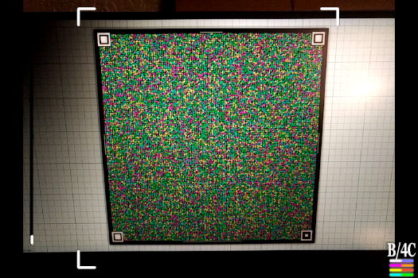
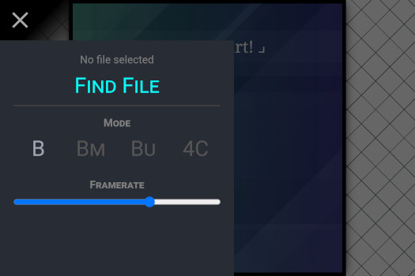

### [INTRODUCTION](https://github.com/sz3/cimbar) | [ABOUT](https://github.com/sz3/cimbar/blob/master/ABOUT.md) | CFC | [LIBCIMBAR](https://github.com/sz3/libcimbar)

# CameraFileCopy

## About

This is an Android app for receiving data over the camera as a one-way data channel. It does not use any antennas (Wi-Fi, Bluetooth, NFC…) or other tricks. Notably, this means it works just as well in airplane mode.

The app reads animated [cimbar codes](https://github.com/sz3/libcimbar). Nearly all the interesting logic is from libcimbar — included via a git subtree.

The *sender* component of CFC is a cimbar encoder — such as https://cimbar.org. Navigate to that website (or use libcimbar's `cimbar_send` to generate barcodes natively), open a file to initialize the cimbar stream, and point the app + camera at the animated barcode.

## Screenshots

| Main screen | Settings |
| --- | --- |
|  |  |

## Release apks

Release apks are also available here: https://github.com/sz3/cfc/releases/

Only arm64-v8a is officially supported at the moment, because that is all I can test for.

## Building

1. Install Android Studio
2. Install the Android NDK
3. Download [OpenCV for Android](https://github.com/opencv/opencv/releases/download/4.5.0/opencv-4.5.0-android-sdk.zip)
4. Create a project with this repo at the root
5. Update `gradle.properties` such that `opencvsdk` point to wherever you extracted the OpenCV Android SDK

I found this project incredibly useful for getting started:

https://github.com/VlSomers/native-opencv-android-template

## Licensing, dependencies, etc

The code in CFC, such as it is, is MIT licensed. It is mostly a blend of various tutorial apps + wrapper code around libcimbar.

The libcimbar code is MPL 2.0. libcimbar's dependencies are a variety of MIT, BSD, zlib, Boost, Apache…
